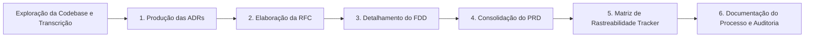

# Da Reunião ao Documento: Design Docs de Alta Fidelidade com IA

Este repositório contém o pacote completo de **Design Docs** para o subsistema de **Webhooks de Notificação de Pedidos** do Order Management System (OMS), concebido e estruturado a partir da gravação e transcrição de uma reunião técnica entre Tech Lead, Product Manager, Engenheiros e Especialista de Segurança (`TRANSCRICAO.md`), e ancorado diretamente na base de código real da aplicação.

---

## 1. Sobre o Desafio

O desafio consiste em assumir o papel de maestro de engenharia assistida por inteligência artificial, transformando uma discussão técnica informal de aproximadamente 55 minutos em um conjunto rigoroso, profissional e diretamente acionável de documentos técnicos de arquitetura e produto. O cenário é de um OMS em produção atendendo clientes corporativos de grande porte (Atlas Comercial, MaxDistribuição e Nova Cargo) que exigem notificações de pedidos em tempo real sob risco de churn.

A principal missão foi estruturar a documentação operando em diferentes "alturas" conceituais (Produto, Arquitetura, Decisão Pontual e Implementação), sem redundâncias indevidas e com tolerância zero a alucinações. Cada decisão, restrição, contrato de API e requisito foi sistematicamente confrontado com a transcrição da reunião e com o código-fonte existente em Node.js/TypeScript e Prisma ORM, preservando o código intacto e focando na produção documental.

---

## 2. Ferramentas de IA Utilizadas

| Ferramenta | Papel e Aplicação no Processo |
| :--- | :--- |
| **Antigravity IDE & Gemini 3.8 / 3.7** | Agente autônomo primário para leitura profunda do repositório, varredura semântica de arquivos, orquestração de planos de implementação e geração iterativa dos arquivos Markdown. |
| **Claude 3.5 Sonnet / Opus (via Prompts)** | Formulação das bases de raciocínio crítico, refinamento de contratos REST, detalhamento de estratégias de resiliência e geração de diagramas de sequência em Mermaid. |
| **Linters e Parsers Automatizados** | Ferramentas estáticas para validação de integridade de links Markdown, consistência de identificadores na matriz de rastreabilidade e checagem de caminhos de arquivos reais. |

---

## 3. Workflow Adotado

A produção seguiu a metodologia de **Engenharia Inversa de Requisitos Orientada a Decisões**, executada na seguinte sequência lógica:



1. **Contextualização e Mapeamento de Ganchos:** Leitura integral da base de código (`src/modules/orders/order.service.ts`, `prisma/schema.prisma`, middlewares e classes de erro) para identificar os exatos pontos onde o novo subsistema se acopla.
2. **ADRs Primeiro (Decisões Fechadas):** Formalização inicial dos 6 pilares arquiteturais em formato MADR (`docs/adrs/`), delimitando trade-offs, tecnologias descartadas e consequências antes de escrever qualquer especificação de sistema.
3. **RFC (Proposta Técnica de Arquitetura):** Redação da proposta em nível macro (2 a 4 páginas), documentando alternativas descartadas na call e registrando pontos em aberto para revisão dos stakeholders.
4. **FDD (Especificação de Baixo Nível):** Detalhamento dos fluxos com diagramas Mermaid, contratos públicos completos de API, matriz de erros com prefixo `WEBHOOK_*`, estratégias de resiliência e a seção mandatória de integração com arquivos reais do projeto.
5. **PRD (Consolidação de Produto e Negócio):** Alinhamento do valor de negócio, metas quantitativas mensuráveis, 12 requisitos funcionais claros, escopo e delimitação explícita do que ficou fora de escopo.
6. **Tracker e Rastreabilidade Cruzada:** Mapeamento bidirecional conectando cada linha dos documentos a timestamps específicos da reunião (`[hh:mm] Nome`) ou a caminhos reais do código.

---

## 4. Prompts Customizados

Abaixo destacam-se dois dos principais prompts elaborados e adaptados para garantir alta densidade técnica e evitar alucinações da IA:

### Prompt 1: Extração Crítica de Decisões e Filtragem Negativa (ADRs e Fora de Escopo)
```markdown
Você é um Arquiteto de Software Principal analisando a transcrição de uma reunião técnica (TRANSCRICAO.md).
Sua missão é extrair as decisões arquiteturais fechadas e as ideias descartadas/adiadas:

DIRETRIZES:
1. Filtre rigorosamente o que NÃO entra no escopo (ex: e-mail de alerta, frontend, brokers externos).
2. Para cada decisão fechada, identifique:
   - Os debatedores e timestamps de decisão ([hh:mm] Nome).
   - A decisão exata e o trade-off explícito assumido.
   - Pelo menos uma alternativa viável que foi colocada na mesa e os argumentos técnicos que levaram ao seu descarte.
   - Os arquivos do código base afetados (ex: src/modules/orders/order.service.ts).
3. Produza o resultado no formato MADR (Markdown Architectural Decision Records).
Não invente informações que não estejam na transcrição ou no código.
```

### Prompt 2: Engenharia de Contratos de API e Matriz de Erros no FDD
```markdown
Atue como Tech Lead responsável pela redação do Feature Design Document (FDD.md).
Com base na transcrição e nos padrões existentes do projeto (AppError, Zod, rotas Express):

1. Especifique pelo menos 4 contratos de endpoints HTTP REST públicos:
   - Inclua Método, Path, Permissão necessária via JWT (operador ou ADMIN).
   - Exiba JSON completo de Request Body e Response (200/201), além de headers.
   - Detalhe a requisição HTTP outbound emitida pelo worker (headers X-Event-Id, X-Signature, X-Timestamp, X-Webhook-Id).
2. Construa a Matriz de Erros completa com o prefixo obrigatório `WEBHOOK_*`, associando cada código ao status HTTP correspondente e à sua condição de disparo.
3. Elabore a seção "Integração com o sistema existente", citando nominalmente pelo menos 4 caminhos reais de arquivos da codebase (ex: order.service.ts, app-error.ts, auth.middleware.ts, logger.ts) e descrevendo a extensão cirúrgica em cada um.
```

---

## 5. Iterações e Ajustes Concretos

Durante o ciclo de desenvolvimento com IA, foram realizadas 4 iterações principais para corrigir alucinações e elevar a precisão dos documentos:

* **Iteração 1 — Eliminação de Alucinação de Notificação por E-mail:**
  * *Problema:* No primeiro rascunho do PRD, a IA incluiu um requisito funcional de "envio de alerta por e-mail quando o webhook falhar 3 vezes consecutivas".
  * *Correção:* A transcrição em `[09:37] Larissa` declarou categoricamente: *"Não. Email tá fora de escopo dessa fase"*. O prompt foi refinado e o item foi movido para a seção "Fora de Escopo" do PRD e para a lista de exclusões do FDD.
* **Iteração 2 — Correção no Acoplamento do Payload (Items do Pedido):**
  * *Problema:* A IA gerou um payload de evento contendo a lista completa de produtos e itens (`OrderItem[]`), o que violaria o teto de 64 KB para pedidos grandes.
  * *Correção:* Identificou-se a fala de Diego em `[09:43]` (*"Não manda items pra não inflar. Se o cliente quiser detalhes, ele bate no GET /orders/:id depois"*). O schema do payload outbound foi refatorado no FDD para incluir apenas dados essenciais (`orderId`, `orderNumber`, `customerId`, `fromStatus`, `toStatus`, `totalCents`).
* **Iteração 3 — Ajuste na Função de Inserção na Transação de Pedidos:**
  * *Problema:* A proposta inicial sugeria injetar todo o `WebhookRepository` dentro do construtor de `OrderService`.
  * *Correção:* Resgatando o diálogo entre Bruno e Diego (`[09:41]`), ajustou-se a especificação para adotar uma função pura `publishWebhookEvent(tx, order, fromStatus, toStatus)` que recebe o `Prisma.TransactionClient` existente, evitando dependências circulares e acoplamento excessivo.
* **Iteração 4 — Definição da Tolerância na Rotação de Secrets (Grace Period):**
  * *Problema:* A primeira versão do endpoint de rotação invalidava a secret antiga imediatamente.
  * *Correção:* Alinhou-se com a diretriz de segurança de Sofia (`[09:21] Sofia`), especificando formalmente que a chave antiga permanece aceita para validação durante um período de tolerância de 24 horas (`gracePeriodUntil`).

---

## 6. Como Navegar a Entrega

A documentação foi estruturada para leitura fluida e progressiva. Recomenda-se a seguinte ordem de leitura:

```
.
├── README.md                                          <-- Você está aqui (Narrativa do processo)
├── TRANSCRICAO.md                                     <-- Fonte da verdade da reunião
└── docs/
    ├── PRD.md                                         <-- 1º: Visão de produto, negócio, escopo e requisitos
    ├── RFC.md                                         <-- 2º: Proposta técnica geral, alternativas e pontos em aberto
    ├── adrs/                                          <-- 3º: Decisões arquiteturais pontuais (MADR)
    │   ├── ADR-001-outbox-no-mysql.md
    │   ├── ADR-002-worker-processo-separado-polling.md
    │   ├── ADR-003-politica-retry-backoff-dlq.md
    │   ├── ADR-004-autenticacao-hmac-sha256-rotacao-secret.md
    │   ├── ADR-005-garantia-at-least-once-com-x-event-id.md
    │   └── ADR-006-reuso-padroes-existentes-projeto.md
    ├── FDD.md                                         <-- 4º: Especificação detalhada de implementação e contratos
    └── TRACKER.md                                     <-- 5º: Matriz completa de rastreabilidade (código e transcrição)
```

---

## 7. Checklist de Critérios de Aceite Atendidos

* [x] **PRD (`docs/PRD.md`)**: Contém todas as 12 seções, 12 requisitos funcionais mapeados, meta quantitativa (<10s para 99% das mensagens, 80% redução de polling), fora de escopo explícito e riscos com severidade e mitigação.
* [x] **RFC (`docs/RFC.md`)**: Conciso (3 páginas), metadados com revisores reais da call, 4 alternativas descartadas com trade-offs, 4 questões em aberto e links cruzados para as 6 ADRs.
* [x] **FDD (`docs/FDD.md`)**: Fluxos com diagramas Mermaid, 5 contratos HTTP públicos completos com payloads de exemplo e status codes, matriz de erros com prefixo `WEBHOOK_*`, observabilidade completa e seção de integração citando 6 arquivos reais do repositório.
* [x] **ADRs (`docs/adrs/`)**: 6 ADRs no formato MADR cobrindo todas as decisões estruturais e citando arquivos reais.
* [x] **Tracker (`docs/TRACKER.md`)**: Tabela completa com 51 linhas, mais de 80% originadas da `TRANSCRICAO` com `[hh:mm] Nome` e 8 linhas ancoradas em `CODIGO` com caminhos reais.
* [x] **Integridade do Código**: 100% dos arquivos de aplicação (`src/`, `prisma/`, `tests/`) mantidos intocados.
