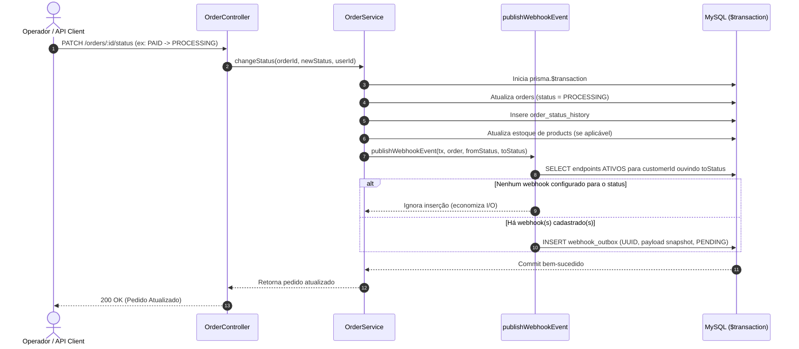
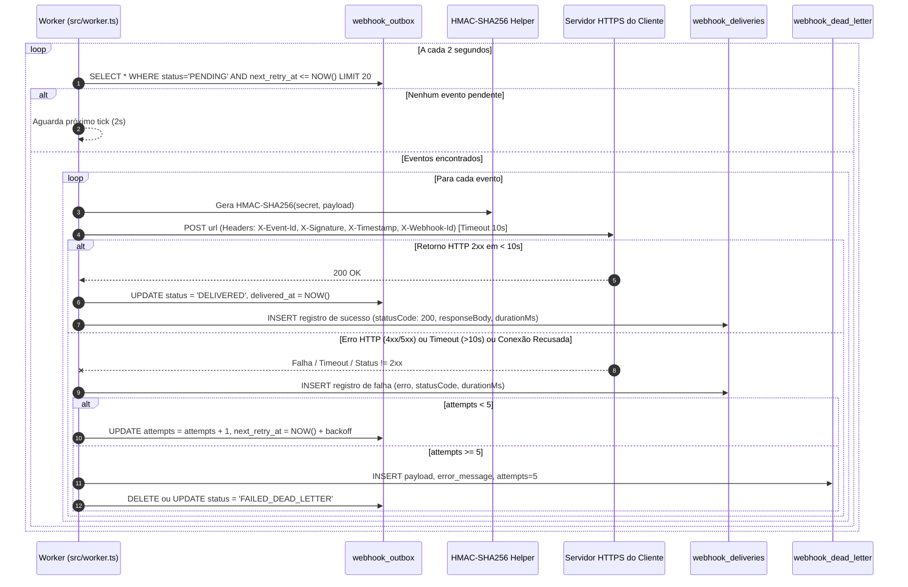

# FDD-001: Especificação de Implementação do Sistema de Webhooks de Notificação de Pedidos

## 1. Contexto e Motivação Técnica

O Order Management System (OMS) opera o ciclo de vida comercial dos pedidos da empresa. Clientes B2B chave (Atlas Comercial, MaxDistribuição e Nova Cargo) necessitam de atualizações de status em tempo real. O modelo atual de polling sobre o endpoint `GET /orders` gera gargalos de banco e latência para as partes.

Tecnicamente, o sistema requer uma solução desacoplada, assíncrona e altamente confiável para emitir requisições HTTP POST para as URLs registradas pelos clientes, garantindo integridade transacional com o banco de dados relacional MySQL via Prisma ORM, segurança criptográfica e tolerância a instabilidades externas de rede.

---

## 2. Objetivos Técnicos

* **Garantir Atomicidade Transacional:** Assegurar que nenhum evento de notificação seja emitido se a transação de mudança de status falhar, e que nenhum pedido atualizado com sucesso deixe de registrar seu respectivo evento (dual-write zero via Transactional Outbox).
* **Desacoplar o Fluxo de Pedidos:** Eliminar bloqueios de I/O de rede externa durante a execução do método `OrderService.changeStatus`.
* **Garantir Confiabilidade e Resiliência:** Sustentar janela de retentativas de até ~15 horas para absorver manutenções nos clientes, preservando histórico de falhas em DLQ.
* **Segurança e Não Repúdio:** Implementar assinatura HMAC-SHA256, rotação de chaves sem indisponibilidade e transporte restrito a HTTPS.
* **Aderência aos Padrões do Repositório:** Seguir fielmente a modularização, manipulação de erros, esquemas de validação e instrumentação de logs existentes.

---

## 3. Escopo e Exclusões

### 3.1. Em Escopo
* Modelagem e migração de tabelas no MySQL via Prisma: `webhook_endpoints`, `webhook_outbox`, `webhook_deliveries` e `webhook_dead_letter`.
* Integração transacional em `src/modules/orders/order.service.ts` através da função `publishWebhookEvent`.
* Processo worker em segundo plano (`src/worker.ts` e `src/modules/webhooks/webhook.worker.ts`) em loop de polling a cada 2 segundos.
* Mecanismo de assinatura HMAC-SHA256 no envio (`X-Signature`), cálculo de timestamps (`X-Timestamp`) e ID de evento (`X-Event-Id`).
* Política de retry com backoff exponencial (1m, 5m, 30m, 2h, 12h) e descarte para DLQ após a 5ª tentativa frustrada.
* Endpoints REST para CRUD de configuração de webhooks, histórico de entregas e replay manual de DLQ para administradores.

### 3.2. Exclusões (Fora de Escopo)
* **Webhooks Inbound:** Recepção de eventos externos pelo OMS (`[09:02] Sofia`, `[09:03] Sofia`).
* **Notificação via E-mail:** Envio de alertas por correio eletrônico em caso de falha persistente de webhooks (`[09:37] Larissa`).
* **Interface Gráfica / Dashboard Frontend:** Criação de telas visuais no portal web (`[09:39] Marcos`, `[09:40] Larissa`).
* **Brokers de Mensageria Dedicados:** Instalação de clusters Redis, RabbitMQ ou Kafka (`[09:07] Diego`).
* **Rate Limiting de Saída:** Fila de limitação de vazão de disparos para clientes em lote (`[09:39] Larissa`).

---

## 4. Fluxos Detalhados da Solução

### 4.1. Fluxo de Criação do Evento na Outbox (Atômico ao Pedido)



### 4.2. Fluxo de Processamento do Worker, Retry e DLQ



---

## 5. Contratos Públicos de API

Todas as rotas exigem cabeçalho `Authorization: Bearer <token_jwt>` e operam no formato `application/json`.

### 5.1. `POST /webhooks` — Cadastrar Novo Endpoint de Webhook

Cria um endpoint de notificação para um cliente específico. A secret é gerada internamente com segurança e devolvida apenas na resposta de criação.

* **Método:** `POST`
* **Caminho:** `/webhooks`
* **Permissão:** Usuário autenticado (`OPERATOR` ou `ADMIN`)

#### Request Body
```json
{
  "customerId": "d8e3b7b2-11c5-4b72-9b2f-37651a70c8d1",
  "url": "https://api.atlascomercial.com.br/integracao/pedidos",
  "events": ["PROCESSING", "SHIPPED", "DELIVERED", "CANCELLED"],
  "description": "Servidor principal de ingestão de pedidos"
}
```

#### Regras de Validação (Zod)
* `customerId`: UUID v4 obrigatório existente na tabela `customers`.
* `url`: URL válida, comprimento máximo de 500 caracteres, obrigatoriamente iniciada por `https://`.
* `events`: Array não vazio com valores válidos do enum `OrderStatus` (`PENDING`, `PAID`, `PROCESSING`, `SHIPPED`, `DELIVERED`, `CANCELLED`).
* `description`: String opcional (máx. 255 caracteres).

#### Response (201 Created)
```json
{
  "id": "e9a71b23-88c1-4d92-bb8a-21f58e1c6670",
  "customerId": "d8e3b7b2-11c5-4b72-9b2f-37651a70c8d1",
  "url": "https://api.atlascomercial.com.br/integracao/pedidos",
  "events": ["PROCESSING", "SHIPPED", "DELIVERED", "CANCELLED"],
  "description": "Servidor principal de ingestão de pedidos",
  "active": true,
  "secret": "whsec_7f9c8d2e4a1b0c3f5e7a9b1c3d5e7f9a1b3c5d7e9f1a3b5c7d9e1f3a5b7c9d1e",
  "createdAt": "2026-09-22T10:00:00.000Z",
  "updatedAt": "2026-09-22T10:00:00.000Z"
}
```

---

### 5.2. `GET /webhooks` — Listar Endpoints de Webhook

Lista os endpoints cadastrados filtrados opcionalmente por `customerId`. Por segurança, a `secret` nunca é retornada nas listagens.

* **Método:** `GET`
* **Caminho:** `/webhooks?customerId=d8e3b7b2-11c5-4b72-9b2f-37651a70c8d1`
* **Permissão:** Usuário autenticado

#### Response (200 OK)
```json
{
  "data": [
    {
      "id": "e9a71b23-88c1-4d92-bb8a-21f58e1c6670",
      "customerId": "d8e3b7b2-11c5-4b72-9b2f-37651a70c8d1",
      "url": "https://api.atlascomercial.com.br/integracao/pedidos",
      "events": ["PROCESSING", "SHIPPED", "DELIVERED", "CANCELLED"],
      "description": "Servidor principal de ingestão de pedidos",
      "active": true,
      "createdAt": "2026-09-22T10:00:00.000Z",
      "updatedAt": "2026-09-22T10:00:00.000Z"
    }
  ],
  "total": 1
}
```

---

### 5.3. `POST /webhooks/:id/rotate-secret` — Rotacionar Secret com Grace Period

Gera uma nova secret ativa para o endpoint. A secret anterior permanece aceita durante 24 horas (`gracePeriodUntil`).

* **Método:** `POST`
* **Caminho:** `/webhooks/:id/rotate-secret`
* **Permissão:** Usuário autenticado

#### Response (200 OK)
```json
{
  "id": "e9a71b23-88c1-4d92-bb8a-21f58e1c6670",
  "newSecret": "whsec_99a8b7c6d5e4f3a2b1c0d9e8f7a6b5c4d3e2f1a0b9c8d7e6f5a4b3c2d1e0f9a8",
  "gracePeriodExpiresAt": "2026-09-23T10:00:00.000Z",
  "message": "Nova secret gerada com sucesso. A secret anterior continuará válida para validação até a data informada."
}
```

---

### 5.4. `GET /webhooks/:id/deliveries` — Histórico de Tentativas de Entrega

Retorna as tentativas de disparo para um webhook específico com suporte a paginação.

* **Método:** `GET`
* **Caminho:** `/webhooks/:id/deliveries?page=1&limit=20`
* **Permissão:** Usuário autenticado

#### Response (200 OK)
```json
{
  "data": [
    {
      "id": "3b6a9c1e-55f2-4d7a-8f12-00b8e72c419a",
      "webhookId": "e9a71b23-88c1-4d92-bb8a-21f58e1c6670",
      "eventId": "f781a26b-4831-419b-a01f-0b3297a7e8e1",
      "attempt": 1,
      "statusCode": 200,
      "success": true,
      "durationMs": 142,
      "errorMessage": null,
      "responseBody": "{\"received\": true}",
      "createdAt": "2026-09-22T10:05:02.142Z"
    }
  ],
  "pagination": {
    "page": 1,
    "limit": 20,
    "total": 1
  }
}
```

---

### 5.5. `POST /admin/webhooks/dead-letter/:id/replay` — Replay Manual de Evento da DLQ

Reenfileira um evento abortado na outbox como `PENDING`, permitindo nova rodada de processamento.

* **Método:** `POST`
* **Caminho:** `/admin/webhooks/dead-letter/:id/replay`
* **Permissão:** Usuário restrito com role `ADMIN` (`requireRole(UserRole.ADMIN)`)

#### Response (200 OK)
```json
{
  "success": true,
  "deadLetterId": "55f24d7a-8f12-00b8-e72c-419a3b6a9c1e",
  "requeuedOutboxId": "a1b2c3d4-e5f6-4a5b-8c9d-0e1f2a3b4c5d",
  "status": "PENDING",
  "replayedAt": "2026-09-22T14:30:00.000Z",
  "replayedByUserId": "c4d5e6f7-a8b9-4c0d-1e2f-3a4b5c6d7e8f"
}
```

---

### 5.6. Contrato Outbound HTTP (Mensagem Emitida pelo Worker)

* **Método:** `POST`
* **Cabeçalhos Enviados:**
  * `Content-Type`: `application/json`
  * `User-Agent`: `OMS-Webhook-Worker/1.0`
  * `X-Event-Id`: `f781a26b-4831-419b-a01f-0b3297a7e8e1` (UUID único de idempotência)
  * `X-Signature`: `t=1758546302,v1=9b3f4e2d8a1c0b7e5f9a2c4e6d8a0b2c4e6f8a0b2c4e6d8a0b2c4e6f8a0b2c4e`
  * `X-Timestamp`: `1758546302` (ou ISO 8601 correspondente)
  * `X-Webhook-Id`: `e9a71b23-88c1-4d92-bb8a-21f58e1c6670`

#### Exemplo de Payload Outbound (Snapshot Imutável)
```json
{
  "eventId": "f781a26b-4831-419b-a01f-0b3297a7e8e1",
  "eventType": "order.status_changed",
  "timestamp": "2026-09-22T10:05:00.000Z",
  "data": {
    "orderId": "09a12b34-56c7-48d9-a0e1-23f456789abc",
    "orderNumber": "ORD-20260922-0001",
    "customerId": "d8e3b7b2-11c5-4b72-9b2f-37651a70c8d1",
    "fromStatus": "PAID",
    "toStatus": "PROCESSING",
    "totalCents": 185000,
    "updatedAt": "2026-09-22T10:05:00.000Z"
  }
}
```
*(Nota técnica: Não inclui `items` para evitar inflar o payload, respeitando rigorosamente o limite de 64KB definido em `[09:43] Diego`)*.

---

## 6. Matriz de Erros Previstos (`WEBHOOK_*`)

Em conformidade com a convenção do projeto estabelecida em `src/shared/errors/app-error.ts`, todos os erros de negócio usam o prefixo `WEBHOOK_`:

| Código de Erro | HTTP Status | Descrição e Causa |
| :--- | :--- | :--- |
| `WEBHOOK_NOT_FOUND` | 404 Not Found | O identificador do webhook ou registro solicitado não existe no banco. |
| `WEBHOOK_INVALID_URL` | 400 Bad Request | A URL informada é malformada ou não utiliza o protocolo seguro `https://`. |
| `WEBHOOK_INVALID_EVENTS` | 400 Bad Request | A lista de eventos contém status inexistentes ou está vazia. |
| `WEBHOOK_CUSTOMER_NOT_FOUND` | 404 Not Found | O `customerId` fornecido não possui registro correspondente. |
| `WEBHOOK_SECRET_REQUIRED` | 400 Bad Request | Falha na geração ou recuperação da chave criptográfica do endpoint. |
| `WEBHOOK_PAYLOAD_TOO_LARGE` | 413 Payload Too Large | O corpo serializado do evento excedeu o limite máximo seguro de 64 KB. |
| `WEBHOOK_DELIVERY_FAILED` | 502 Bad Gateway | O endpoint receptor do cliente retornou erro de protocolo ou status 4xx/5xx. |
| `WEBHOOK_DELIVERY_TIMEOUT` | 504 Gateway Timeout | O endpoint receptor do cliente não respondeu dentro do teto de 10 segundos. |
| `WEBHOOK_REPLAY_INVALID` | 400 Bad Request | Tentativa de replay de evento já reenfileirado ou inexistente na DLQ. |
| `WEBHOOK_INACTIVE` | 422 Unprocessable Entity | Tentativa de disparo ou operação sobre um webhook marcado como desativado. |

---

## 7. Estratégias de Resiliência e Políticas de Retry

* **Timeout Estrito de Chamada:** Cada conexão HTTP efetuada pelo worker utiliza timeout de conexão e de resposta de **10 segundos** (`[09:42] Diego`).
* **Progressão do Backoff Exponencial:**
  * Tentativa 1 (falha inicial): aguarda **1 minuto** (`+1m`)
  * Tentativa 2: aguarda **5 minutos** (`+5m`)
  * Tentativa 3: aguarda **30 minutos** (`+30m`)
  * Tentativa 4: aguarda **2 horas** (`+2h`)
  * Tentativa 5: aguarda **12 horas** (`+12h`)
* **Critério de Encaminhamento para DLQ:** Se a 5ª tentativa falhar, o status do evento na outbox é encerrado e uma entrada correspondente é gravada na tabela `webhook_dead_letter` contendo o payload íntegro, código de status recebido e mensagem de erro para análise técnica.
* **Idempotência no Cliente:** A semântica é *at-least-once*. Os clientes devem armazenar o identificador `X-Event-Id` por pelo menos 24 horas para ignorar mensagens repetidas oriundas de retentativas causadas por falha de confirmação de rede.

---

## 8. Observabilidade: Métricas, Logs e Tracing

### 8.1. Logs Estruturados (Pino)
Em conformidade com `src/config/logger.ts`, todos os logs devem ser emitidos em JSON estruturado com campos contextuais padronizados:
```json
{
  "level": 30,
  "time": 1758546302150,
  "pid": 12044,
  "hostname": "oms-worker-01",
  "module": "webhooks",
  "component": "WebhookWorker",
  "eventId": "f781a26b-4831-419b-a01f-0b3297a7e8e1",
  "webhookId": "e9a71b23-88c1-4d92-bb8a-21f58e1c6670",
  "attempt": 2,
  "statusCode": 200,
  "durationMs": 184,
  "msg": "Webhook delivery succeeded"
}
```

### 8.2. Métricas Chave
* `webhooks_events_enqueued_total`: Contador de eventos gerados na outbox (discriminado por `to_status` e `customer_id`).
* `webhooks_delivery_attempts_total`: Contador de disparos efetuados (com tags `status_code`, `success: true|false`).
* `webhooks_delivery_duration_seconds`: Histograma de tempo de resposta dos endpoints de clientes.
* `webhooks_dead_letter_total`: Contador de mensagens que atingiram limite de retry e entraram na DLQ.
* `webhooks_outbox_pending_gauge`: Medidor em tempo real da quantidade de eventos pendentes na tabela outbox (alerta de acúmulo se > 500).

### 8.3. Tracing Distribuído
O cabeçalho `X-Event-Id` propagado em todas as requisições HTTP permite correlacionar o log da alteração do pedido no OMS com os logs de ingestão no servidor do cliente parceiro.

---

## 9. Dependências e Compatibilidade

* **Runtime:** Node.js 18+ LTS / 20+ LTS
* **Linguagem:** TypeScript 5.x
* **Framework:** Express.js 4.x
* **ORM:** Prisma 5.x com MySQL 8.x
* **Criptografia:** Módulo nativo `node:crypto` (`crypto.createHmac`, `crypto.randomBytes`)
* **HTTP Client no Worker:** `fetch` nativo do Node.js ou `axios` com configuração explícita de `timeout: 10000` e `signal: AbortSignal.timeout(10000)`.

---

## 10. Integração com o Sistema Existente

Esta seção mapeia os pontos exatos de extensão da base de código do OMS para garantir integração cirúrgica:

1. **[src/modules/orders/order.service.ts](file:///c:/Users/USER/workspace-antiigravity/mba-ia-desafio-design-docs-com-ia/src/modules/orders/order.service.ts):**
   * *Extensão:* O método `changeStatus` executa uma transação gerenciada via `prisma.$transaction`. Uma chamada à função auxiliar pura `publishWebhookEvent(tx, updatedOrder, previousStatus, newStatus)` será inserida imediatamente após a gravação de `order_status_history`. Se a gravação na outbox falhar, a transação inteira do pedido sofre rollback automático, garantindo consistência estrita.
2. **[src/shared/errors/app-error.ts](file:///c:/Users/USER/workspace-antiigravity/mba-ia-desafio-design-docs-com-ia/src/shared/errors/app-error.ts):**
   * *Extensão:* Criação de subclasses especializadas derivadas de `AppError` para o domínio de webhooks (ex: `WebhookNotFoundError`, `WebhookInvalidUrlError`, `WebhookPayloadTooLargeError`, `WebhookReplayInvalidError`), todas recebendo seus respectivos códigos padronizados com o prefixo `WEBHOOK_*`.
3. **[src/middlewares/auth.middleware.ts](file:///c:/Users/USER/workspace-antiigravity/mba-ia-desafio-design-docs-com-ia/src/middlewares/auth.middleware.ts):**
   * *Extensão:* As rotas CRUD de `/webhooks` utilizam o middleware `authMiddleware` existente para validar credenciais de operadores/usuários. A rota crítica `POST /admin/webhooks/dead-letter/:id/replay` acopla adicionalmente o middleware `requireRole(UserRole.ADMIN)` para garantir que operadores comuns não possam disparar reprocessamentos de mensagens.
4. **[src/config/logger.ts](file:///c:/Users/USER/workspace-antiigravity/mba-ia-desafio-design-docs-com-ia/src/config/logger.ts):**
   * *Extensão:* O logger Pino existente é importado diretamente no worker `src/worker.ts` e nos serviços de webhooks, garantindo que logs de ciclo de vida de rede, erros de entrega e replays possuam o mesmo formato padronizado de logging do restante do OMS.
5. **[src/middlewares/error.middleware.ts](file:///c:/Users/USER/workspace-antiigravity/mba-ia-desafio-design-docs-com-ia/src/middlewares/error.middleware.ts):**
   * *Extensão:* O interceptor de exceções `errorHandler` captura e serializa automaticamente as instâncias de erro de webhook herdadas de `AppError`, retornando respostas HTTP padronizadas com formato `{ error: { code, message, details } }` sem necessidade de código novo de tratamento.
6. **[prisma/schema.prisma](file:///c:/Users/USER/workspace-antiigravity/mba-ia-desafio-design-docs-com-ia/prisma/schema.prisma):**
   * *Extensão:* Adição dos novos modelos de dados (`WebhookEndpoint`, `WebhookOutbox`, `WebhookDelivery` e `WebhookDeadLetter`) utilizando UUIDs (`@db.Char(36)`), índices otimizados para polling (`@@index([status, nextRetryAt])`) e integridade relacional.

---

## 11. Critérios de Aceite Técnicos

* [ ] Eventos de outbox são gravados atomicamente na mesma transação de `changeStatus` em `src/modules/orders/order.service.ts`.
* [ ] Nenhuma chamada HTTP outbound é disparada síncronamente pela thread da API web.
* [ ] O script `npm run worker` inicializa o processo independente com loop a cada 2 segundos.
* [ ] Requisições para cadastrar webhooks com URLs `http://` são rejeitadas com erro 400 (`WEBHOOK_INVALID_URL`).
* [ ] Cada webhook possui sua secret gerada aleatoriamente devolvida exclusivamente na criação ou rotação.
* [ ] O cabeçalho `X-Signature` confere exatamente com o HMAC-SHA256 do corpo serializado.
* [ ] Rotação de secret mantém a chave antiga funcional por 24 horas (`gracePeriodExpiresAt`).
* [ ] Cada tentativa de disparo gera um registro em `webhook_deliveries` com tempo de resposta e código de status.
* [ ] Falhas atingem no máximo 5 tentativas (1m, 5m, 30m, 2h, 12h) antes de serem transferidas para a DLQ.
* [ ] O endpoint de replay de DLQ é inacessível para usuários sem a role `ADMIN`.

---

## 12. Riscos e Mitigações

| Risco Técnico | Probabilidade | Impacto | Mitigação |
| :--- | :--- | :--- | :--- |
| **Cliente com endpoint lento retém thread do worker** | Alta | Médio | Configuração de timeout inegociável de 10 segundos com `AbortSignal.timeout(10000)`. |
| **Vazamento acidental de secret em logs** | Baixa | Alto | A secret nunca é impressa em logs do Pino e nunca é retornada nas rotas `GET /webhooks` ou `GET /deliveries`. |
| **Replay malicioso de eventos capturados na rede** | Baixa | Alto | Headers combinados `X-Timestamp`, `X-Event-Id` e assinatura HMAC-SHA256 sobre todo o corpo do request. |
| **Crescimento excessivo da tabela de outbox** | Média | Médio | Índices compostos por status e data; especificação de rotina de purga para registros entregues após 30 dias. |
