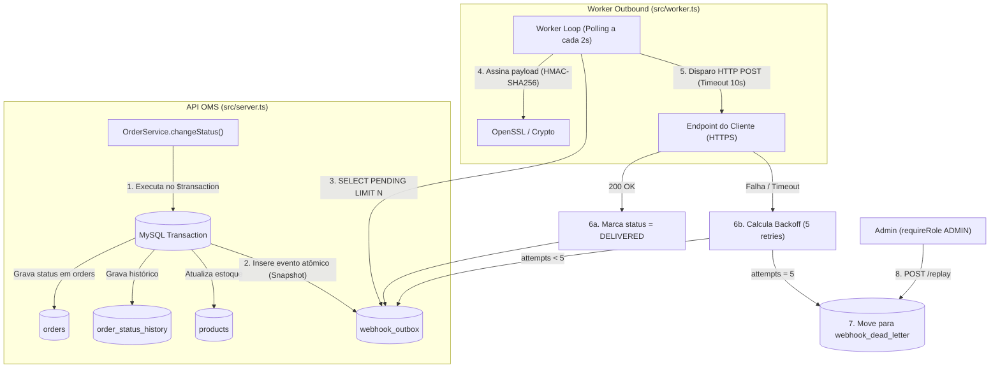

# RFC-001: Sistema de Webhooks para Notificação de Mudança de Status de Pedidos

## Metadados

* **Autor:** Bruno (Engenheiro Pleno, Time de Pedidos)
* **Status:** Em Revisão
* **Data:** 2026-09-22
* **Revisores:**
  * Larissa (Tech Lead)
  * Marcos (Product Manager)
  * Diego (Engenheiro Sênior, Time de Plataforma)
  * Sofia (Engenheira de Segurança)
* **Prazo Estimado de Implementação:** 3 sprints (incluindo 2 dias úteis dedicados para revisão formal de segurança por Sofia)

---

## 1. Resumo Executivo (TL;DR)

Esta RFC propõe a implementação de um subsistema de **Webhooks Outbound** no Order Management System (OMS) para notificar sistemas externos de clientes B2B em tempo real (< 10 segundos) sempre que o status de um pedido for alterado.

A arquitetura proposta baseia-se no **Transactional Outbox Pattern** no banco de dados MySQL existente, garantindo consistência atômica com o ciclo de vida do pedido sem introduzir novas dependências de infraestrutura (como Redis ou Kafka). Os eventos persistidos na outbox serão processados por um **worker independente em polling de 2 segundos** (`src/worker.ts`), com política de resiliência composta por **5 tentativas de retentativa com backoff exponencial** (1m, 5m, 30m, 2h, 12h) e direcionamento final para uma **Dead Letter Queue (DLQ)** persistida em tabela dedicada com suporte a replay administrativo manual.

A segurança da comunicação é assegurada por **assinatura HMAC-SHA256** enviada no header `X-Signature`, gerada a partir de uma secret criptográfica exclusiva por endpoint com suporte a **rotação sem downtime (grace period de 24 horas)** e exigência obrigatória de **TLS/HTTPS**. O contrato de entrega adota semântica **at-least-once**, transferindo a deduplicação para o cliente consumidor mediante o envio do header único `X-Event-Id` (UUID).

---

## 2. Contexto e Problema

Três dos maiores clientes B2B da nossa plataforma — **Atlas Comercial**, **MaxDistribuição** e **Nova Cargo** — solicitaram formalmente um mecanismo reativo de notificação de atualização de pedidos. Atualmente, esses clientes realizam consultas periódicas intensivas (*polling*) na rota `GET /orders`, acarretando:

1. **Sobrecarga de Infraestrutura:** Consumo desnecessário de conexões e computação no banco MySQL e no pool da API para responder a requisições com dados inalterados.
2. **Latência de Integração e Custo Operacional:** Para os clientes, o intervalo entre polling gera atrasos no fluxo logístico e de faturamento.
3. **Risco Crítico de Negócio:** A Atlas Comercial indicou explicitamente risco de migração para a concorrência caso uma solução automatizada de notificações em tempo real não seja disponibilizada até o término do trimestre atual (`[09:00] Marcos`).

A aplicação atual é um monólito modular estruturado em Node.js com TypeScript e Prisma ORM, onde a máquina de estados de pedidos é orquestrada transacionalmente por [OrderService.changeStatus](file:///c:/Users/USER/workspace-antiigravity/mba-ia-desafio-design-docs-com-ia/src/modules/orders/order.service.ts). O sistema atual **não possui nenhum mecanismo prévio de eventos, filas assíncronas ou notificações externas**, sendo este o vácuo de arquitetura que esta proposta pretende preencher.

---

## 3. Proposta Técnica

A solução é desenhada com baixo acoplamento, alta resiliência e mínima sobrecarga operacional:

### 3.1. Transactional Outbox Pattern
A alteração de status invocará a função pura `publishWebhookEvent(tx, order, fromStatus, toStatus)` dentro do `$transaction` existente em `src/modules/orders/order.service.ts`. O evento será persistido na tabela `webhook_outbox` com o payload serializado em JSON no momento exato da transição (snapshot imutável contendo identificadores e valores básicos, omitindo a lista detalhada de itens para manter o tamanho reduzido e inferior ao teto de 64KB).

### 3.2. Worker Desacoplado em Polling
Um processo Node.js dedicado (`src/worker.ts`) consultará periodicamente (a cada 2 segundos) os registros pendentes (`status = 'PENDING' AND next_retry_at <= NOW()`), executando as requisições HTTP outbound com timeout estrito de 10 segundos.

### 3.3. Segurança e Assinatura Criptográfica
Cada cadastro de webhook possui uma secret gerada criptograficamente. O worker computa o HMAC-SHA256 do corpo serializado e o insere no header `X-Signature`. URLs sem HTTPS são rejeitadas preventivamente no cadastro via Zod. O endpoint de rotação (`POST /webhooks/:id/rotate-secret`) mantém a chave anterior funcional durante uma janela de 24 horas (grace period) antes de revogá-la.

### 3.4. Resiliência e DLQ
Falhas transitórias acionam uma rotina de 5 tentativas espaçadas (1m, 5m, 30m, 2h, 12h), totalizando cerca de 15 horas de tolerância a quedas no cliente. Falhas persistentes são transferidas para a tabela `webhook_dead_letter`, permitindo reprocessamento via endpoint administrativo protegido por autenticação JWT e validação de role `ADMIN`.

---

## 4. Alternativas Consideradas e Descartadas

Durante a reunião técnica com os times de engenharia, arquitetura e produto, as seguintes alternativas foram discutidas e rejeitadas:

| Alternativa | Descrição | Motivo do Descarte / Trade-off | Origem |
| :--- | :--- | :--- | :--- |
| **Disparo HTTP Síncrono no OrderService** | Efetuar a requisição HTTP para o cliente diretamente no método `changeStatus`. | **Descartada:** Clientes lentos reteriam conexões e locks no MySQL, degradando toda a API. Falhas de rede no cliente poderiam induzir rollbacks indevidos de pedidos legítimos ou causar perda silenciosa de notificações. | `[09:04] Bruno`, `[09:06] Diego` |
| **Broker de Mensageria Dedicado (Redis Streams / RabbitMQ)** | Publicar mensagens em uma fila dedicada externa para consumo assíncrono. | **Descartada:** A equipe de plataforma e sustentação é enxuta; gerenciar um cluster Redis/RabbitMQ configurado para alta disponibilidade traria sobrecarga operacional e de custos injustificáveis (overengineering) para o momento da empresa, além do risco de inconsistência por dual-write. | `[09:07] Larissa`, `[09:07] Diego` |
| **Triggers de Banco de Dados no MySQL** | Utilizar gatilhos relacionais no MySQL para notificar o consumidor de eventos. | **Descartada:** O MySQL não dispõe de primitivas nativas de publicação/notificação assíncrona (como `LISTEN`/`NOTIFY` do PostgreSQL). Gatilhos só executam SQL interno e forçar integrações externas por triggers acarretaria soluções frágeis e anti-padrões. | `[09:09] Diego`, `[09:10] Larissa` |
| **Garantia de Entrega Exactly-Once** | Desenvolver protocolo complexo de handshake bilateral para certificar entrega estritamente única. | **Descartada:** Virtualmente inexequível em redes HTTP abertas entre organizações heterogêneas sem coordenação bilateral de alto acoplamento. A semântica de mercado *at-least-once* com chave de idempotência `X-Event-Id` atende 100% dos requisitos. | `[09:25] Diego`, `[09:25] Sofia` |

---

## 5. Questões em Aberto e Pontos Adiados

Os seguintes pontos foram debatidos e categorizados para acompanhamento pós-lançamento:

1. **Rate Limiting de Envio Outbound (`[09:38] Diego`, `[09:39] Larissa`):**
   * *Questão:* Caso um cliente tenha 50 pedidos alterados em menos de 1 minuto, o disparo consecutivo de requisições pode sobrecarregar a infraestrutura receptora do cliente (efeito denial of service involuntário).
   * *Decisão:* Não fará parte do escopo inicial (MVP). A equipe de engenharia e observabilidade monitorará a taxa de envio nos primeiros 30 dias de produção para avaliar a necessidade de uma fila de vazão limitada (*token bucket* ou *leaky bucket* por cliente).
2. **Escalabilidade Horizontal de Workers e Concorrência (`[09:12] Diego`, `[09:13] Diego`):**
   * *Questão:* O modelo inicial adota um *single-worker* que garante a ordem sequencial de envio por pedido. Se o throughput de eventos crescer significativamente, será necessário instanciar múltiplos workers em paralelo.
   * *Decisão:* Adiada para futura fase de escala. Quando múltiplos workers forem introduzidos, a equipe avaliará particionamento de leitura por hash de `order_id` ou uso de concorrência com `SELECT ... FOR UPDATE SKIP LOCKED`.
3. **Mecanismo de Alerta por E-mail em Falha Crítica (`[09:37] Marcos`, `[09:37] Larissa`):**
   * *Questão:* Notificar clientes proativamente por e-mail após sucessivas falhas de entrega de seus webhooks.
   * *Decisão:* Fora de escopo desta fase. Adiado para reavaliação após validação da estabilidade dos endpoints parceiros.
4. **Painel Visual / Dashboard no Frontend (`[09:39] Marcos`, `[09:40] Larissa`):**
   * *Questão:* Construção de tela no portal web do cliente para gerenciar webhooks e visualizar logs.
   * *Decisão:* Descartado do escopo de backend. O cliente B2B interagirá diretamente através de endpoints REST documentados.

---

## 6. Impacto e Riscos

* **Desempenho da Base de Dados:** O polling contínuo a cada 2 segundos adiciona carga constante de leitura no MySQL.
  * *Mitigação:* As queries filtram estritamente pelo índice composto `(status, next_retry_at, created_at)` com paginação fixa (`LIMIT N`), consumindo frações desprezíveis de milissegundos.
* **Volume Histórico da Tabela Outbox:** Crescimento acumulado de eventos entregues.
  * *Mitigação:* Planejamento de job de purga/arquivamento para registros entregues com mais de 30 dias.
* **Exposição de Informações Sensíveis:** Tráfego de pedidos em redes externas.
  * *Mitigação:* O payload transmite apenas metadados e totalizadores de alto nível (sem detalhamento individual de itens de catálogo). O tráfego exige HTTPS e validação de autenticidade HMAC-SHA256, com homologação mandatória da Engenharia de Segurança.

---

## 7. Decisões Arquiteturais Relacionadas (ADRs)

As decisões de engenharia detalhadas nesta proposta encontram-se formalmente registradas e aprovadas nos respectivos registros:

1. [ADR-001: Padrão Outbox no MySQL para Notificação de Eventos de Pedido](file:///c:/Users/USER/workspace-antiigravity/mba-ia-desafio-design-docs-com-ia/docs/adrs/ADR-001-outbox-no-mysql.md)
2. [ADR-002: Worker em Processo Separado em Polling](file:///c:/Users/USER/workspace-antiigravity/mba-ia-desafio-design-docs-com-ia/docs/adrs/ADR-002-worker-processo-separado-polling.md)
3. [ADR-003: Política de Retry com Backoff Exponencial e Tabela Dedicada de DLQ](file:///c:/Users/USER/workspace-antiigravity/mba-ia-desafio-design-docs-com-ia/docs/adrs/ADR-003-politica-retry-backoff-dlq.md)
4. [ADR-004: Autenticação por Assinatura HMAC-SHA256, Secret Única por Endpoint e Rotação com Grace Period](file:///c:/Users/USER/workspace-antiigravity/mba-ia-desafio-design-docs-com-ia/docs/adrs/ADR-004-autenticacao-hmac-sha256-rotacao-secret.md)
5. [ADR-005: Garantia de Entrega At-Least-Once com Header X-Event-Id e Snapshot Imutável de Payload](file:///c:/Users/USER/workspace-antiigravity/mba-ia-desafio-design-docs-com-ia/docs/adrs/ADR-005-garantia-at-least-once-com-x-event-id.md)
6. [ADR-006: Reuso dos Padrões Arquiteturais e Estruturais Existentes do Projeto](file:///c:/Users/USER/workspace-antiigravity/mba-ia-desafio-design-docs-com-ia/docs/adrs/ADR-006-reuso-padroes-existentes-projeto.md)
